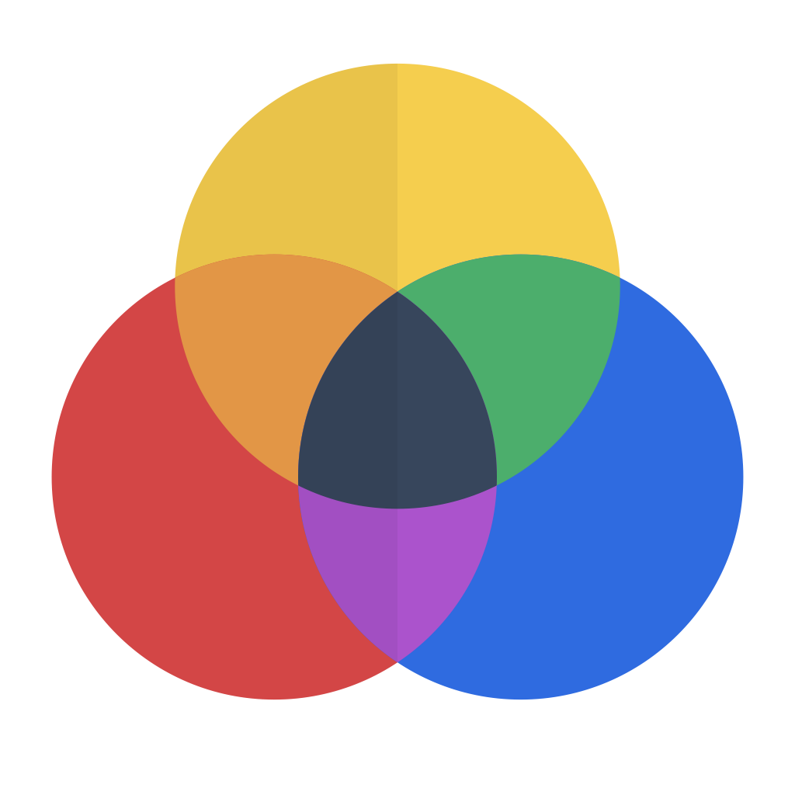
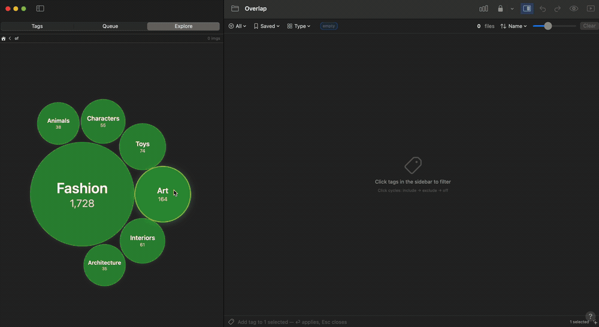
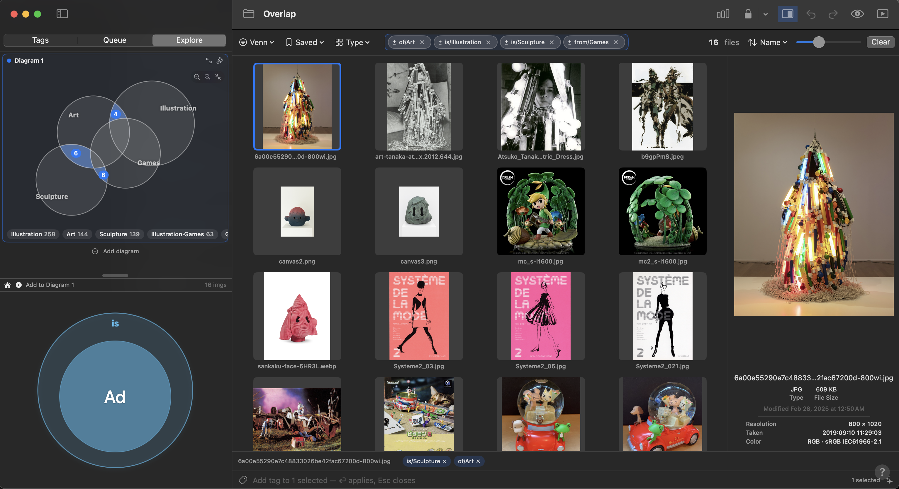
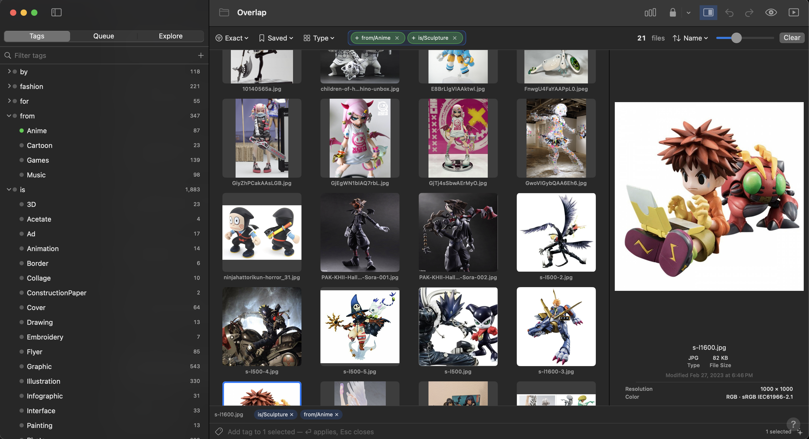
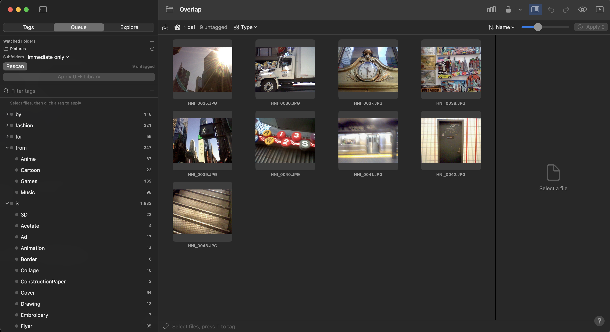
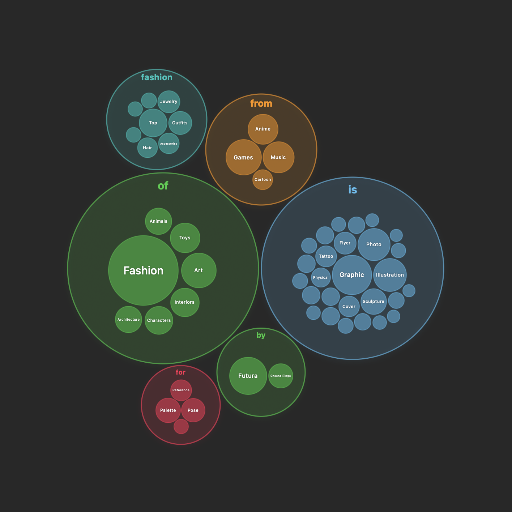

<div align="center">



# Overlap

**Tag and query any file with native macOS Finder tags — boolean/Venn queries, batch workflows, and content-based suggestions.**

[](LICENSE)
&nbsp;
&nbsp;

</div>

Overlap reads and writes real macOS tags (`com.apple.metadata:_kMDItemUserTags`), so everything stays interoperable with Finder, Spotlight, and other tag tools — nothing is locked in a private database. It works on **any file type** (images, video, audio, PDFs, text, archives, even folders), not just photos.

<div align="center">



</div>

## Screenshots

| Explore — Venn query | Tags — grid + preview |
|---|---|
|  |  |
| **Queue — intake & drill** | **Explore — tag map** |
|  |  |

## Features

- **Boolean & Venn queries** — tri-state tag chips (include / exclude / off) with **All** (AND), **Any** (OR), **Exact** (only these tags), and multi-diagram **Groups** (`(A OR B) AND C`). Paint regions of a Venn diagram to select exact intersections; the diagram is laid out from the real data.
- **Saved queries** — name and reuse a whole Venn setup (diagrams + excludes).
- **Any file type** — images, video (inline playback), audio, PDFs, text, archives, and folders. Filter results by **kind** or **extension**.
- **Live results grid** — QuickLook thumbnails (ImageIO fallback for odd files), animated GIFs, adjustable size, multi-select, keyboard navigation.
- **Split preview** — a large live preview with per-type info (resolution, duration, size, dates) and image EXIF (camera, lens, exposure).
- **Slideshow** — auto-advancing preview over the results, arrow-key nav, interval + shuffle.
- **Fast tagging** — quick-tag bar (`T`, type-ahead), drag-onto-tag, click-to-apply; create / rename / **merge** / delete tags.
- **Queue** — watch folders for untagged files, tag them, then **Apply** to move them into your library. Configurable depth and **Finder-style drill-in**.
- **Tag suggestions** — content-based suggestions from a plugin extension point (see [Plugins](#plugins)).
- **Hidden tags** — passcode-gate sensitive tags; per-tag default include/exclude.
- **Undo/redo** across every mutation (⌘Z / ⌘⇧Z), plus Stats, Fix Extension, Reveal, Export, and drag-out to other apps.

## Build

Requires Xcode 15+ (macOS 13+). The project is generated with [XcodeGen](https://github.com/yonaskolb/XcodeGen):

```sh
brew install xcodegen
xcodegen generate
open Overlap.xcodeproj      # ⌘R
```

Overlap runs unsandboxed so it can read and write Finder tags across your folders.

## Usage

1. Point it at a folder (toolbar folder button, default `~/Pictures`). Spotlight must have indexed the scope for tags to appear.
2. Filter by clicking sidebar tags (cycle include → exclude → off), or paint Venn regions in **Explore**. Narrow by file **Type** as needed.
3. Select files, press **T**, type a tag, ⏎ — tags are written to the files, so Finder and Spotlight see them immediately.
4. **Queue**: add watched folders, set the subfolder depth, tag the untagged items, then **Apply** to move them into your library.

> Tags live on the files. Deleting a tag in Overlap removes it everywhere — Finder, Spotlight, other tools.

## Architecture

- **Catalog** — an `NSMetadataQuery` (`kMDItemUserTags LIKE '*'`) finds every tagged item of any type. Metadata is parsed off the main thread and cached to `~/Library/Application Support/Overlap/`, so tags appear instantly on the next launch. Firmlink path aliases (`/Users` vs `/System/Volumes/Data/Users`) are canonicalized to avoid duplicates.
- **One model** — `TagStore` is the single source of truth. The query is a list of `VennGroup`s evaluated as **sum-of-products**: `OR` starts a clause, `AND` binds diagrams within it. Sidebar, chips, Venn, and saved queries all edit this one model.
- **Venn layout** — deterministic, data-driven geometry (`VennLayout.swift`): each pair of circles targets a distance from its real overlap, then relaxation + hard constraints settle it. It's SwiftUI-free, so a headless validator (`scripts/validate-venn.swift`) can replay the exact layout and check every selected region renders.
- **Tag I/O** — writes go through `URLResourceValues.tagNames`; every mutation is undoable.

## Plugins

Tag suggestions come from an **out-of-process plugin system** — standalone executables, in any language, discovered at runtime. Overlap pipes a JSON request to a plugin's stdin and reads suggestions from stdout, so suggestion logic (e.g. a future Apple Vision + clustering engine) ships separately from the app.

→ **[How to write a plugin](docs/PLUGINS.md).**

## Credits

Inspired by **[Tagception](https://madebyevan.com/tagception/)** by **[Evan Wallace](https://madebyevan.com/)** — the project that showed how good a Finder-tag browser can feel.

## License

Overlap is free software under the **[GNU GPL v3.0](LICENSE)**. You may use, study, share, and modify it; any derivative you distribute must also be open source under the GPL. Free, forever.
